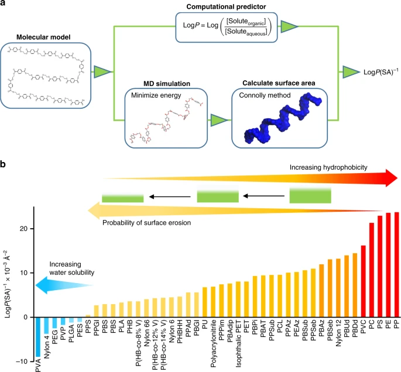

# python 演習5
## 海洋性生分解性ポリマー編

**目　標**：　本講座の目標

## MOESM5_ESMデータセット
MOESM5_ESM data setは、ペンシルバニア州立大学Robert T. Mathers教授らの論文[1]で公開されている文献にある海洋性生分解性ポリマーのデータセットです。ポリマーの構造、物性、文献にある分解実験データをデータベース化したものです。

直鎖、分岐、環状の構造を持つポリエステル、ポリアセタール、ポリアクリルアミド、PC、ポリエーテル、PE、PP、ポリシロキサン、PS、PU、PVCを含む110種類以上のポリマーについて調査され、ここに含まれるプラスチックは、市販のサンプルと実験室で作られたものです。

ポリマーは、クラス（すなわち、ポリマーのタイプ）、試料（すなわち、フィルム、パウダー）、物理的属性（すなわち、質量、体積、表面対体積比）、実験パラメーター（すなわち、海水中での時間、温度）によって分類された。また、海水にさらされた際の重量減少や、生物学的・生物学的条件も記録した。さらに、分子レベルの記述子とバルクポリマー記述子によって、各ポリマーを区別した。

バルク特性記述子には、密度、重量平均分子量(Mw)、数平均分子量(Mn)、分散度(Mw/Mn)、Tg、融解温度(Tm)、結晶化度、融解エンタルピー(すなわち、必要なエネルギー量(J g-1))が含まれています。

分子レベルの記述子には、ハイブリダイゼーション（sp3、sp2）の概念を用いた炭素、酸素、窒素原子の種類と、ポリマー中のこれらの原子の割合が含まれています。分子レベルの構造的特徴を捉えるために、データベースはモノマーあたりの水素の数、モノマーあたりのCH3、CH2、CH基の数、環状環の数、環状環に含まれる原子の割合が示されています。

また、各ポリマーの油状または撥水性を連続的に定量化するために、疎水性と呼ばれる概念を検討されています。

---
[1] Kyungjun Min, Joseph D. Cuiffi & Robert T. Mathers　"Ranking environmental degradation trends of plastic marine debris based on physical properties　and molecular structure", NATURE COMMUNICATIONS. 11, Article number: 727 (2020) https://www.nature.com/articles/s41467-020-14538-z

---

## 演習コード
Google Colabでステップ・バイ・ステップで動作を確認しながら進めます．下記のボタンを押して進んでください．

  

